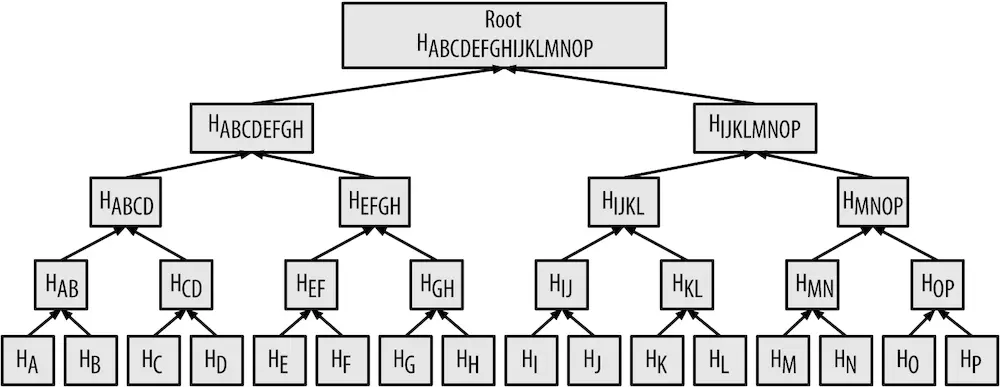

# Merkle 树

Merkle 树，也被称为[哈希](hash.md)树，是一种树型数据结构。

Merkle 树可用于快速验证大数据对象的局部完整性。以最常见的二叉 Merkle 树为例。先把大数据对象分割成数据块，并计算各块的哈希值，生成叶子节点。叶子节点两两分组，取其哈希值的组合再计算哈希值，生成父节点。以此类推，直到只生成了一个父节点的时候，用其作为 Merkle 树的根节点。

